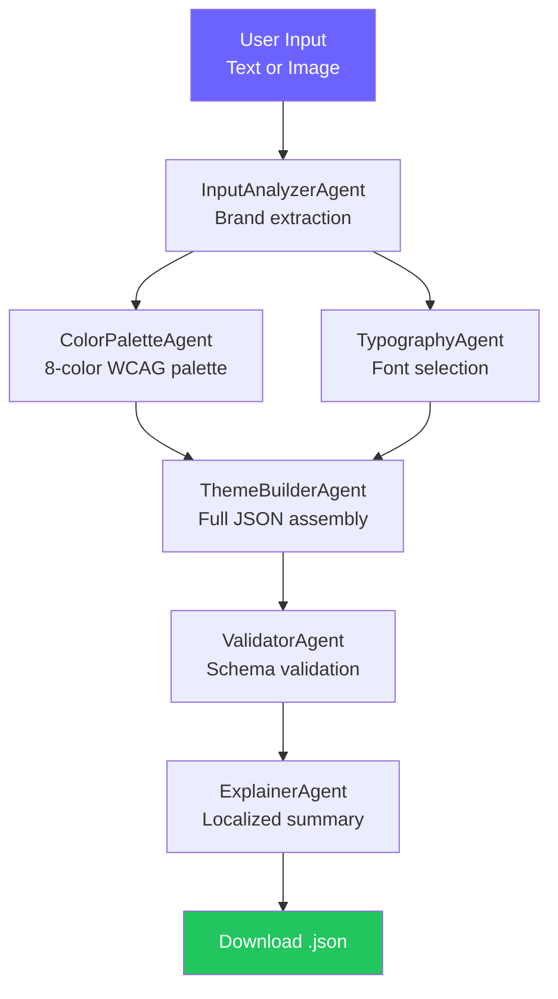

# PBI Theme Generator AI

Generate Power BI Desktop theme JSON files from a text description or brand image — powered by a multi-agent AI pipeline.

**[Live Demo](https://pbi-theme-generator.vercel.app)** | [Français](#fr)

---

## Features

- **Text or Image Input** — Describe your brand or upload a logo/style guide
- **6-Agent AI Pipeline** — Each step handled by a specialized Claude AI agent
- **WCAG AA Accessible** — Color palettes validated for contrast compliance
- **Live Preview** — See colors, fonts, and JSON before downloading
- **9 Languages** — FR, EN, ES, IT, PT, DE, ZH, AR, HI
- **Instant Download** — Get a ready-to-import `.json` theme file

## Architecture



Each agent is a standalone function calling Claude Sonnet via the Anthropic API. The orchestrator chains them via Server-Sent Events for real-time progress tracking.

## Tech Stack

| Layer | Technology |
|-------|-----------|
| Framework | Next.js 14 (App Router) |
| Language | TypeScript |
| Styling | Tailwind CSS |
| AI | Claude Sonnet 4.5 (Anthropic API) |
| i18n | next-intl (9 languages) |
| Deployment | Vercel |

## Quick Start

### Prerequisites

- Node.js 18+
- Anthropic API key ([get one here](https://console.anthropic.com/))

### Installation

```bash
git clone https://github.com/CustomDigitalServices-Kevin/pbi-theme-generator.git
cd pbi-theme-generator
npm install
cp .env.example .env
```

Edit `.env` and set your API key:

```
ANTHROPIC_API_KEY=sk-ant-api03-your-key-here
```

### Development

```bash
npm run dev
```

Open [http://localhost:3000](http://localhost:3000).

### Build

```bash
npm run build
npm start
```

## Project Structure

```
pbi-theme-generator/
├── app/
│   ├── api/generate/route.ts    # SSE endpoint — orchestrates agents
│   ├── [locale]/
│   │   ├── layout.tsx           # Localized root layout
│   │   └── page.tsx             # Main single-page UI
│   ├── layout.tsx               # Root layout (redirect)
│   └── globals.css              # Global styles
├── components/
│   ├── LanguageSelector.tsx     # 9-language dropdown
│   ├── InputZone.tsx            # Text/image input toggle
│   ├── PipelineTracker.tsx      # Real-time 6-step progress
│   ├── ColorPreview.tsx         # Color swatch grid
│   └── JsonPreview.tsx          # Collapsible JSON viewer
├── lib/agents/
│   ├── types.ts                 # Shared TypeScript types
│   ├── orchestrator.ts          # Agent pipeline (async generator)
│   ├── inputAnalyzer.ts         # Agent 1: Brand analysis
│   ├── colorPalette.ts          # Agent 2: WCAG color palette
│   ├── typography.ts            # Agent 3: Font selection
│   ├── themeBuilder.ts          # Agent 4: JSON assembly
│   ├── validator.ts             # Agent 5: Schema validation
│   └── explainer.ts             # Agent 6: Localized summary
├── i18n/
│   ├── routing.ts               # Locale routing config
│   └── request.ts               # Server-side locale resolution
├── messages/                    # Translation files (9 languages)
│   ├── en.json
│   ├── fr.json
│   └── ...
├── middleware.ts                 # next-intl locale middleware
├── .env.example
├── vercel.json
└── LICENSE (MIT)
```

## Deployment

### Vercel (recommended)

1. Push to GitHub
2. Import in [Vercel](https://vercel.com)
3. Add `ANTHROPIC_API_KEY` in Environment Variables
4. Deploy

### Manual

```bash
npm run build
npm start
```

---

<a id="fr"></a>

## FR — Documentation en français

### Fonctionnalités

- **Saisie texte ou image** — Décrivez votre marque ou uploadez un logo
- **Pipeline de 6 agents IA** — Chaque étape gérée par un agent Claude spécialisé
- **Accessibilité WCAG AA** — Palettes de couleurs validées pour le contraste
- **Aperçu en direct** — Visualisez couleurs, polices et JSON avant téléchargement
- **9 langues** — FR, EN, ES, IT, PT, DE, ZH, AR, HI
- **Téléchargement instantané** — Obtenez un fichier `.json` prêt à importer

### Installation

```bash
git clone https://github.com/CustomDigitalServices-Kevin/pbi-theme-generator.git
cd pbi-theme-generator
npm install
cp .env.example .env
# Éditez .env avec votre clé API Anthropic
npm run dev
```

### Déploiement Vercel

1. Poussez vers GitHub
2. Importez dans Vercel
3. Ajoutez `ANTHROPIC_API_KEY` dans les variables d'environnement
4. Déployez

---

MIT License — Built with Claude AI
