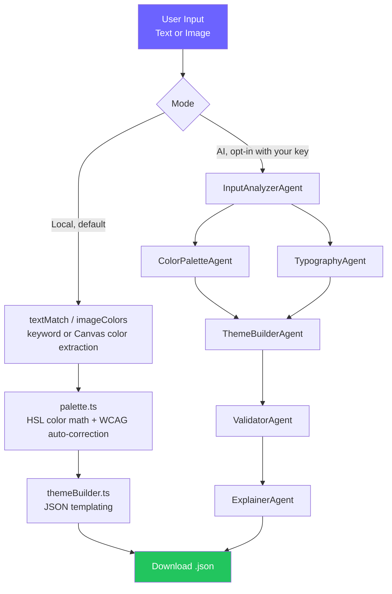

# PBI Theme Generator AI

Generate Power BI Desktop theme JSON files from a text description or brand image. Runs **100% locally in your browser by default** — no AI, no account, no network request. An optional AI mode is available with your own API key (Mistral or Anthropic), sent directly from your browser to the provider.

[Français](#fr)

---

## Features

- **Local by default, zero network** — a deterministic engine (HSL color math + WCAG contrast + curated typography presets) builds a complete theme entirely in your browser. No data ever leaves your device in this mode.
- **Optional AI mode (BYOK)** — bring your own Mistral or Anthropic API key for richer, more nuanced results, especially for open-ended text descriptions. The key is sent directly to the provider from your browser and stored only in that tab's session storage — never on any server.
- **Text or Image Input** — describe your brand, or upload a logo/style guide (dominant colors extracted via Canvas in Local mode; sent as an image to the model in AI mode)
- **WCAG AA Accessible** — every generated color is verified (and auto-corrected if needed) against the real W3C contrast formula, and the UI itself (focus rings, ARIA roles, keyboard navigation) targets WCAG AA
- **Live Preview** — see colors, fonts, and JSON before downloading
- **9 Languages** — FR, EN, ES, IT, PT, DE, ZH, AR, HI (including full RTL support for Arabic)
- **Fully static** — the whole app builds to static HTML/JS/CSS (`next.config.mjs` → `output: 'export'`); it can be hosted on any static file server, no Node runtime required in production

## Architecture

Two independent generation pipelines share the same output contract (`PowerBITheme` JSON + `ColorPalette` + localized explanation), so the UI (pipeline tracker, color preview, JSON viewer) works identically regardless of which one ran:



**Local mode** (`lib/local/`): a fully deterministic pipeline — no LLM, no network. Color relationships are computed with plain HSL math (`palette.ts`), every color is checked against the official W3C relative luminance formula and auto-adjusted until it clears WCAG AA (`contrast.ts`), and the theme JSON is assembled by templating (`themeBuilder.ts`). Text input is matched against a curated dictionary of named colors, industries, and moods (`textMatch.ts`) — this is keyword matching, not natural language understanding, and the UI says so.

**AI mode** (`lib/agents/` + `lib/ai/`, opt-in, requires your own key): the original 6-agent pipeline, now running entirely client-side. `lib/ai/mistralClient.ts` and `lib/ai/anthropicClient.ts` both implement a shared `AIExecutor` interface so the six agent prompts (unchanged) work with either provider. Mistral (default) uses `mistral-small-2603` for every step with native structured-output JSON Schema support; Anthropic (alternative) keeps the original Haiku/Sonnet tiering, configured in `lib/agents/models.ts`.

## Tech Stack

| Layer | Technology |
|-------|-----------|
| Framework | Next.js 16 (App Router, Turbopack, static export) |
| UI | React 19 |
| Language | TypeScript |
| Styling | Tailwind CSS v4 (CSS-first `@theme`) |
| Local engine | Pure TypeScript — no dependencies (`lib/local/`) |
| Optional AI | Mistral (`mistral-small-2603`, default) or Anthropic (Haiku/Sonnet, alternative) — both called directly from the browser with a user-supplied key |
| i18n | next-intl v4 (9 languages), static export compatible |
| Testing | Vitest + Testing Library |

## Quick Start

### Prerequisites

- **Node.js 20.9+** — [download here](https://nodejs.org/) (required by Next.js 16)
- That's it. No API key, no account, no `.env` file needed to run the app in its default mode.

### Installation

```bash
git clone https://github.com/CustomDigitalServices-Kevin/PBI-Theme-Generator-AI.git
cd PBI-Theme-Generator-AI
npm install
npm run dev
```

Open [http://localhost:3000](http://localhost:3000) — Local mode works immediately, no setup required.

### Using AI mode (optional)

Click the mode badge in the top-right corner, choose "AI", pick a provider, and paste your own API key:

- **Mistral** — get a key at [console.mistral.ai](https://console.mistral.ai/)
- **Anthropic** — get a key at [console.anthropic.com](https://console.anthropic.com/)

The key is stored only in your browser tab's session storage (cleared when you close the tab) and is sent directly from your browser to the provider's API — it never passes through any server operated by this project.

### Build (static export)

```bash
npm run build
```

Produces a fully static site in `out/` — every locale is prerendered as its own HTML file (`out/en.html`, `out/fr.html`, ...). Preview it locally with any static server, e.g.:

```bash
npx serve out
# or
python -m http.server 8080 --directory out
```

### Tests

```bash
npm test        # run once
npm run test:watch
```

### Deployment

The build output (`out/`) is plain static files — deploy it to any static host (nginx on a VPS, Vercel static export, Netlify, GitHub Pages, S3 + CloudFront, ...). No Node.js runtime, no server process, and no environment variables are required in production, since:

- Local mode never leaves the browser.
- AI mode calls the provider's API directly from the browser using a key the user supplies at runtime — there is nothing for a server to hold or proxy.

## Local mode limitations (be honest about this)

The text-matching engine (`lib/local/textMatch.ts`) is keyword/preset matching against a curated dictionary — roughly a dozen industries, five tones, and ~35 named colors — not natural language understanding. It works well for inputs like `"blue fintech startup, corporate"` and poorly for open-ended prose like `"something that feels like a Sunday morning in autumn"`. The UI displays an honest hint about this next to the text input, and free-form descriptions get noticeably better results in AI mode. Image mode (dominant color extraction via Canvas) has no such limitation — it works the same way regardless of mode.

## Project Structure

```
pbi-theme-generator/
├── app/
│   ├── [locale]/
│   │   ├── layout.tsx           # Localized layout, self-hosted fonts, setRequestLocale
│   │   └── page.tsx             # Main single-page UI — mode dispatch, no fetch/SSE
│   ├── page.tsx                 # Root '/' — static-export-compatible redirect to defaultLocale
│   ├── fonts.ts                 # next/font/google (Inter, JetBrains Mono)
│   ├── layout.tsx               # Root layout (passthrough)
│   └── globals.css              # Tailwind v4 @theme + global styles
├── components/
│   ├── LanguageSelector.tsx     # 9-language dropdown
│   ├── ModeSelector.tsx         # Local / AI (BYOK) mode + provider + key panel
│   ├── InputZone.tsx            # Text/image input toggle
│   ├── PipelineTracker.tsx      # Real-time 6-step progress (either pipeline)
│   ├── ColorPreview.tsx         # Color swatch grid
│   └── JsonPreview.tsx          # Collapsible JSON viewer
├── lib/local/                    # Deterministic, no-AI generation engine
│   ├── color.ts                 # hex/RGB/HSL conversions
│   ├── contrast.ts               # W3C relative luminance + WCAG auto-correction
│   ├── textMatch.ts              # Keyword/preset matching (text mode)
│   ├── imageColors.ts            # Canvas dominant-color extraction (image mode)
│   ├── typography.ts             # Curated font presets per tone
│   ├── themeBuilder.ts           # PowerBITheme JSON assembly
│   ├── generateLocalTheme.ts     # Orchestrator (async generator)
│   └── __tests__/                # 67 vitest tests
├── lib/agents/                    # AI pipeline (provider-agnostic prompts)
│   ├── types.ts                 # Shared TypeScript types (both pipelines)
│   ├── models.ts                # Per-provider, per-agent model selection
│   ├── schemas.ts                # JSON Schemas for Mistral structured output
│   ├── orchestrator.ts          # AI pipeline (async generator)
│   └── {inputAnalyzer,colorPalette,typography,themeBuilder,validator,explainer}.ts
├── lib/ai/                        # Browser-side AI provider clients (BYOK)
│   ├── types.ts                 # AIExecutor interface
│   ├── mistralClient.ts          # Default provider
│   ├── anthropicClient.ts        # Alternative provider
│   ├── createExecutor.ts         # Per-agent executor factory
│   └── storage.ts                # sessionStorage-only credential storage
├── i18n/
│   ├── routing.ts               # Locale routing config (localePrefix: always)
│   └── request.ts               # Locale resolution
├── messages/                    # Translation files (9 languages, 56 keys each)
├── eslint.config.mjs             # ESLint flat config
├── vitest.config.ts
├── vercel.json
└── LICENSE (MIT)
```

---

<a id="fr"></a>

## FR — Documentation en français

Génère des fichiers de thème Power BI Desktop à partir d'une description texte ou d'une image de marque. Tourne **100 % localement dans votre navigateur par défaut** — aucune IA, aucun compte, aucune requête réseau. Un mode IA optionnel est disponible avec votre propre clé API (Mistral ou Anthropic), envoyée directement depuis votre navigateur au fournisseur.

### Fonctionnalités

- **Local par défaut, zéro réseau** — un moteur déterministe (mathématiques de couleur HSL + contraste WCAG + presets typographiques curés) construit un thème complet entièrement dans votre navigateur. Aucune donnée ne quitte votre appareil dans ce mode.
- **Mode IA optionnel (BYOK)** — apportez votre propre clé API Mistral ou Anthropic pour des résultats plus riches, notamment pour les descriptions textuelles libres. La clé est envoyée directement au fournisseur depuis votre navigateur et stockée uniquement dans la session de cet onglet — jamais sur un serveur.
- **Saisie texte ou image** — décrivez votre marque, ou uploadez un logo/guide de style
- **Accessibilité WCAG AA** — chaque couleur générée est vérifiée (et corrigée automatiquement si besoin) selon la formule de contraste W3C réelle
- **Aperçu en direct** — visualisez couleurs, polices et JSON avant téléchargement
- **9 langues** — FR, EN, ES, IT, PT, DE, ZH, AR, HI (support RTL complet pour l'arabe)
- **Entièrement statique** — l'application se compile en HTML/JS/CSS statique, hébergeable sur n'importe quel serveur de fichiers statiques

### Stack technique

| Couche | Technologie |
|--------|-------------|
| Framework | Next.js 16 (App Router, Turbopack, export statique) |
| UI | React 19 |
| Style | Tailwind CSS v4 (`@theme` CSS-first) |
| Moteur local | TypeScript pur — zéro dépendance (`lib/local/`) |
| IA optionnelle | Mistral (`mistral-small-2603`, défaut) ou Anthropic (Haiku/Sonnet, alternatif) — appelés directement depuis le navigateur |
| i18n | next-intl v4 (9 langues), compatible export statique |
| Tests | Vitest + Testing Library |

### Prérequis

- **Node.js 20.9+** (requis par Next.js 16)
- C'est tout. Aucune clé API, aucun compte, aucun fichier `.env` requis pour lancer l'application en mode par défaut.

### Installation

```bash
git clone https://github.com/CustomDigitalServices-Kevin/PBI-Theme-Generator-AI.git
cd PBI-Theme-Generator-AI
npm install
npm run dev
```

Ouvrez [http://localhost:3000](http://localhost:3000) — le mode Local fonctionne immédiatement, sans configuration.

### Utiliser le mode IA (optionnel)

Cliquez sur le badge de mode en haut à droite, choisissez « AI », sélectionnez un fournisseur, et collez votre propre clé API :

- **Mistral** — obtenez une clé sur [console.mistral.ai](https://console.mistral.ai/)
- **Anthropic** — obtenez une clé sur [console.anthropic.com](https://console.anthropic.com/)

La clé est stockée uniquement dans la session de votre onglet (effacée à la fermeture) et envoyée directement depuis votre navigateur à l'API du fournisseur — elle ne transite jamais par un serveur de ce projet.

### Build (export statique)

```bash
npm run build
```

Produit un site entièrement statique dans `out/` — chaque langue est prégénérée en fichier HTML dédié (`out/en.html`, `out/fr.html`, ...).

### Tests

```bash
npm test
```

### Limites du mode texte local

Le moteur de correspondance textuelle (`lib/local/textMatch.ts`) fonctionne par mots-clés/presets sur un dictionnaire curé — une douzaine de secteurs, cinq tons, ~35 couleurs nommées — ce n'est PAS de la compréhension du langage naturel. Il fonctionne bien pour des entrées comme « blue fintech startup, corporate » et moins bien pour du texte libre ouvert. L'interface affiche une indication honnête à ce sujet ; le mode IA donne de meilleurs résultats pour les descriptions ouvertes.

---

MIT License
